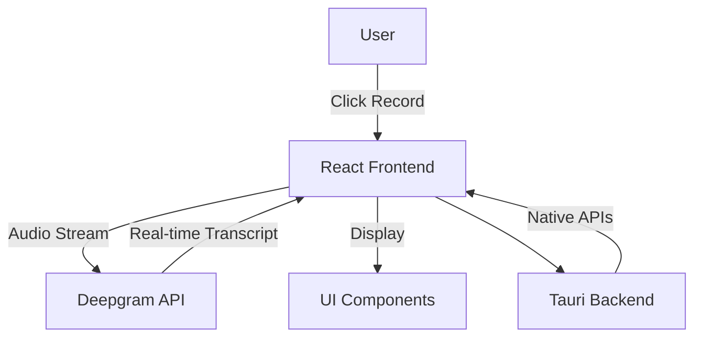
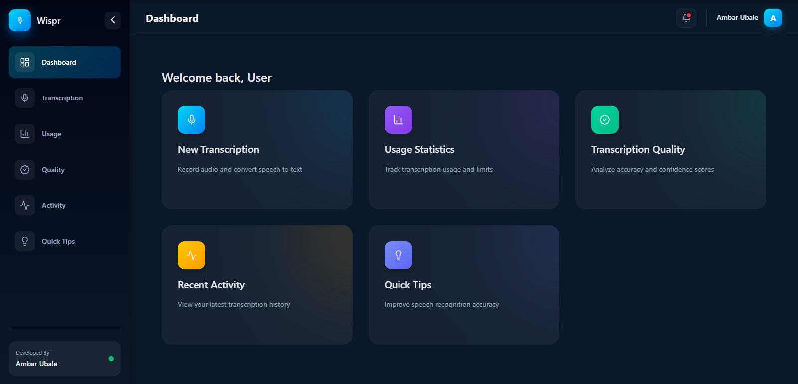
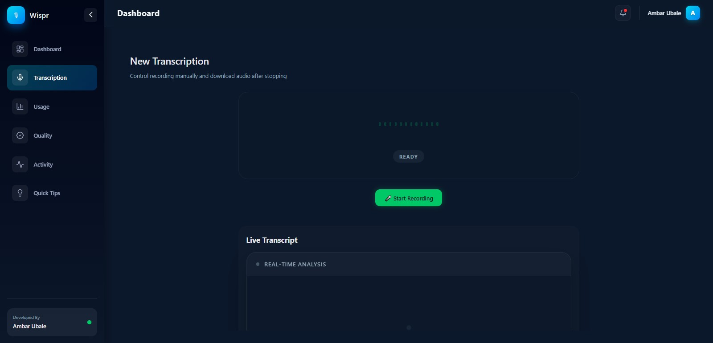

# 🎙 Wispr-Tauri-Clone – AI Voice-to-Text Desktop App

A **cross-platform desktop application** that converts voice to text in **real-time**, inspired by Wispr Flow.  
Built with **Tauri, React, and Deepgram API**, this project demonstrates practical skills in **AI-powered desktop application development**.

---

## 🚀 Project Overview

This project is a **functional clone of Wispr Flow**, focusing on **core voice-to-text workflow** rather than pixel-perfect UI:

- Real-time transcription from microphone input
- Smooth collapsible sidebar for navigation
- Cross-platform support (Windows, macOS, Linux)
- Clean and maintainable code

---

## 🧩 Features

- 🎤 **Real-Time Voice Transcription** – Powered by Deepgram API
- ⌨️ **Push-to-Talk** voice input with recording controls
- 🧭 **Collapsible Sidebar** with Framer Motion animations
- 📊 **Dashboard, Usage & Quality Pages** – Visual analytics via Recharts
- 💻 **Cross-Platform Desktop App** using Tauri
- 🔒 **Error Handling** – Network, API, and permission management
- ⚡ Modern React + TypeScript frontend with clean UI

---

## 🧠 Tech Stack

### Frontend

- React + TypeScript
- React Router v7
- Framer Motion
- Lucide Icons
- Recharts

### Backend / AI

- Deepgram API (Speech-to-Text)
- Web Audio API (Microphone capture)

### Desktop

- Tauri (Rust backend for native features)

---

## 📁 Project Structure

```txt
Wispr-Tauri-Clone/
├── .gitignore
├── README.md
├── package.json
├── package-lock.json
├── tsconfig.json
├── vite.config.ts
├── .env.example
├── src/
│   ├── App.tsx
│   ├── App.css
│   ├── context/
│   │   └── AppContext.tsx
│   ├── layout/
│   │   ├── Sidebar.tsx
│   │   └── Topbar.tsx
│   ├── pages/
│   │   ├── Dashboard.tsx
│   │   ├── Transcription.tsx
│   │   ├── Usage.tsx
│   │   ├── Quality.tsx
│   │   ├── Activity.tsx
│   │   └── Tips.tsx
│   ├── services/
│   │   └── transcription.ts
│   └── styles/
│       └── sidebar.css
├── src-tauri/
│   ├── Cargo.toml
│   └── src/
│       └── main.rs
├── screenshots/
│   ├── dashboard.gif
│   ├── transcription.gif
│   └── sidebar.gif
```

---

## 🏗 Architecture Diagram



**Explanation:**

- **React Frontend**: Handles UI, routing, and user interactions
- **Deepgram API**: Receives microphone audio and returns transcription
- **Tauri Backend**: Enables native desktop features and cross-platform support
- **UI Components**: Sidebar, Topbar, Dashboard, Transcription, etc.

---

## 🎯 Transcription Workflow

1. User presses **Record** button
2. Microphone audio captured via Web Audio API
3. Audio streamed to **Deepgram API**
4. Partial transcripts appear live
5. Final transcript replaces partial text

---

## 🎥 ScreenShots

<h3>Dashboard</h3>


<h3>Live Transcription</h3>


---

## ⚙️ Installation & Setup

### 1️⃣ Clone Repository

```bash
git clone https://github.com/Ambarubale6061/Wispr-Tauri-Clone.git
cd Wispr-Tauri-Clone
```

### 2️⃣ Install Dependencies

```bash
npm install
```

### 3️⃣ Add Environment Variables

Create `.env`:

```env
VITE_DEEPGRAM_API_KEY=your_deepgram_api_key_here
```

### 4️⃣ Run App in Development

```bash
npm run tauri dev
```

### 5️⃣ Build for Production

```bash
npm run build
npm run tauri build
```

---

## 🛠 Architectural Notes

- **Separation of Concerns:** UI (React) vs Audio Capture vs Deepgram service
- **State Management:** `AppContext` for global app state (recording, transcripts)
- **Routing:** React Router for multiple pages
- **Tauri Backend:** Handles native desktop features and system APIs

**Known Limitations:**

- Minimal UI polish; only essential animations (sidebar)
- Basic error handling (network/API/permission)
- No advanced production optimizations

---

## 📄 Assignment Compliance

- ✅ Push-to-talk + real-time transcription implemented
- ✅ Collapsible sidebar with smooth animation
- ✅ Cross-platform desktop support
- ✅ Clean, modular, maintainable code
- ✅ Architecture and workflow clearly documented

---

## 👨‍💻 Author

**Ambar Ubale** – Full Stack Developer

- GitHub: [Ambarubale6061](https://github.com/Ambarubale6061)
- Portfolio: https://ambarportfolio.vercel.app/

---

## ⭐ Support

- ⭐ Star the repository
- 🍴 Fork and experiment
- 🧠 Contribute ideas

---

**Wispr-Tauri-Clone – Speak. Transcribe. Flow.**
